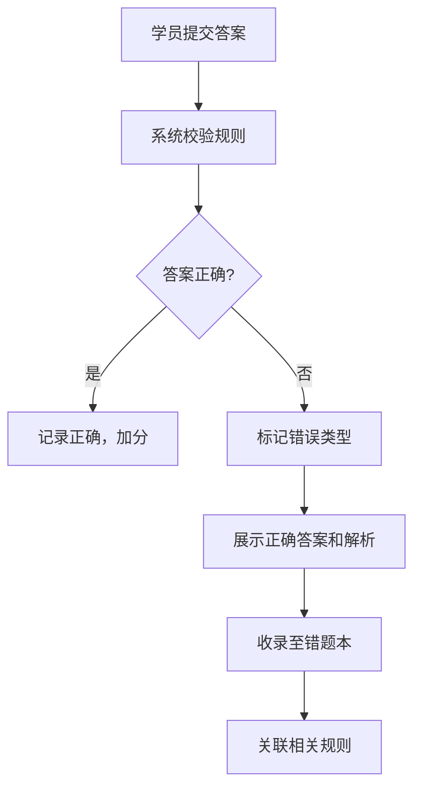

## 1. 产品概述

政务服务事项编制演练平台是一个面向新入职事项管理员、窗口骨干和政务服务培训班学员的纯前端教学演练系统。通过仿真方式帮助学员学习实施清单编制规则和识别常见错误，将经验型工作转化为可复制的标准化流程。

- **核心目标**：降低清单编制培训门槛，提升编制质量，减少常见错误
- **目标用户**：新入职事项管理员、窗口业务骨干、政务服务培训班学员
- **应用场景**：各地清单编制专项整治前集中培训、单位内部上岗培训、日常业务练习

## 2. 核心功能

### 2.1 用户角色

| 角色 | 注册方式 | 核心权限 |
|------|----------|----------|
| 学员 | 系统内置（演示模式） | 使用所有学习模块、查看个人成绩、收藏示例、管理错题本 |

### 2.2 功能模块

1. **规则课堂**：分类展示编制规则，支持按事项类型查看，收藏优秀示例
2. **案例演练**：按事项类型推送练习，模拟填写受理条件和申请材料，判断法定依据与要素匹配，识别承诺时限问题，练习材料减免编写，跨地区写法对比
3. **闯关审校**：限时完成审校任务，逐题即时纠错，随机抽取综合编制题
4. **错题本**：自动收录错误题目，分类统计，支持重做练习
5. **成绩面板**：培训考核结果展示，个人薄弱点画像，学习进度追踪

### 2.3 页面详情

| 页面名称 | 模块名称 | 功能描述 |
|---------|---------|---------|
| 首页/导航 | 全局导航 | 5个模块入口切换、学习进度总览、快捷操作区 |
| 规则课堂 | 规则分类列表 | 按事项类型分类展示编制规则，支持搜索筛选 |
| 规则课堂 | 规则详情 | 展示具体规则条款、常见错误示例、正确示范、关联练习入口 |
| 规则课堂 | 我的收藏 | 展示已收藏的优秀示例，支持取消收藏 |
| 案例演练 | 练习选择 | 按事项类型选择练习，展示难度等级、预计时长 |
| 案例演练 | 模拟填写 | 表单式填写受理条件、申请材料，支持富文本编辑 |
| 案例演练 | 依据匹配 | 选择法定依据，系统判断是否支撑所填要素并给出反馈 |
| 案例演练 | 时限判断 | 识别承诺时限设置不当，对比法定时限与承诺时限 |
| 案例演练 | 减免练习 | 练习材料减免情形编写，判断是否符合政策要求 |
| 案例演练 | 地区对比 | 并排展示同一事项不同地区的写法差异 |
| 闯关审校 | 闯关大厅 | 展示关卡列表、进度、解锁条件、限时要求 |
| 闯关审校 | 审校答题 | 限时答题界面，随机抽题，倒计时显示，逐题纠错 |
| 闯关审校 | 结算页面 | 展示本关成绩、用时、错误分布、通关评价 |
| 错题本 | 错题列表 | 按错误类型分类展示错题，支持筛选、重做 |
| 错题本 | 错题详情 | 展示错误答案、正确答案、解析、相关规则链接 |
| 成绩面板 | 总览仪表盘 | 总体正确率、学习时长、已完成练习数、薄弱项雷达图 |
| 成绩面板 | 薄弱点画像 | 按知识点维度展示错误率，提供改进建议 |
| 成绩面板 | 考核报告 | 综合考核结果、能力评估、培训证书预览 |

## 3. 核心流程

### 用户学习主流程

学员登录系统 → 进入规则课堂学习基础规则 → 选择案例演练进行专项练习 → 系统即时纠错并收录错题 → 完成一定练习后解锁闯关审校 → 限时完成闯关任务 → 查看成绩报告和薄弱点 → 针对错题进行强化练习 → 完成培训考核

### 答题纠错流程

## 4. 用户界面设计

### 4.1 设计风格

- **主色调**：政务蓝（#1E40AF）作为主色，代表专业、可信；辅以深青色（#0F766E）作为强调色
- **辅助色**：成功绿（#059669）、警告橙（#D97706）、错误红（#DC2626）用于状态提示
- **中性色**：灰白渐变背景，深蓝卡片，清晰的视觉层级
- **按钮风格**：圆角8px，悬停微放大+阴影加深，点击反馈
- **字体**：标题使用"Noto Serif SC"（思源宋体）体现正式感，正文使用"Noto Sans SC"保证可读性
- **布局风格**：卡片式布局，左导航+主内容区，信息密度适中
- **图标风格**：使用Lucide图标库，线性风格，统一24px尺寸

### 4.2 页面设计概览

| 页面名称 | 模块名称 | UI元素 |
|---------|---------|--------|
| 首页 | 仪表盘 | 顶部欢迎区、5模块快捷入口卡片、学习进度圆环、今日推荐练习 |
| 规则课堂 | 规则列表 | 左侧分类树、右侧卡片列表、搜索框、筛选标签、收藏按钮 |
| 规则课堂 | 详情页 | 标题区、规则正文、常见错误警示卡、正确示例高亮区、相关练习链接 |
| 案例演练 | 答题页 | 左侧题目导航、中间答题区（表单/选择题）、右侧辅助信息（法定依据、提示） |
| 案例演练 | 地区对比 | 左右两栏并排布局、差异点高亮标注、差异说明浮层 |
| 闯关审校 | 答题页 | 顶部倒计时进度条、题目卡片、选项区、提交按钮、实时得分 |
| 错题本 | 列表页 | 错误类型筛选器、错题卡片（含错误标记）、重做按钮、错题数统计 |
| 成绩面板 | 仪表盘 | 数据卡片矩阵、薄弱点雷达图、学习趋势折线图、能力标签云 |

### 4.3 响应式设计

- **桌面优先**：设计以1280px及以上宽度为主，采用12列栅格系统
- **平板适配**：左侧导航可折叠，主内容区自适应，卡片改为2列布局
- **触摸优化**：按钮最小尺寸44px，增加触摸反馈，优化表单填写体验

### 4.4 动效设计

- **页面加载**：骨架屏渐入，内容区块错峰上滑入场（staggered reveal）
- **答题反馈**：正确答案绿色闪光+轻微弹跳，错误答案红色震动+翻转动画展示正确答案
- **倒计时**：剩余时间30秒时数字变红+脉冲动画
- **通关庆祝**：彩屑飘落效果，成绩数字滚动动画
- **悬停效果**：卡片上浮+阴影加深，按钮背景色渐变过渡
