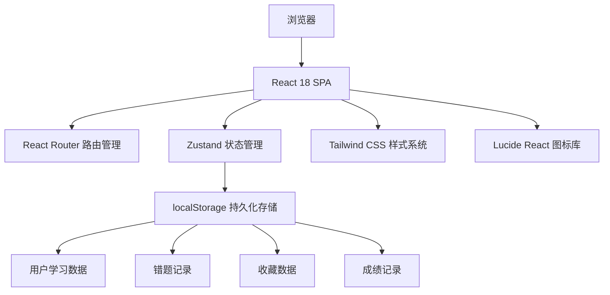
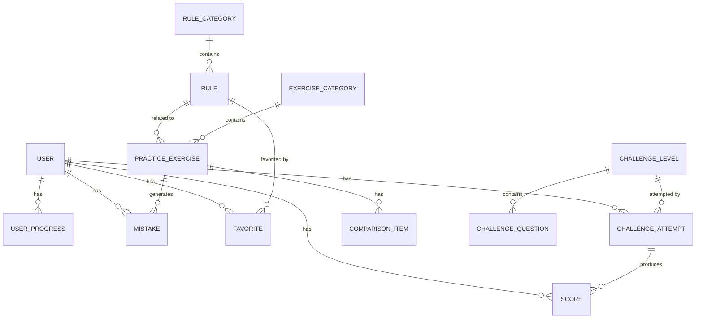

## 1. 架构设计

本项目为纯前端教学演练平台，无需后端服务，所有数据通过Mock方式存储在浏览器本地（localStorage）。采用单页应用架构，通过React Router实现前端路由。



## 2. 技术描述

- **前端框架**：React@18 + TypeScript@5
- **构建工具**：Vite@5
- **路由管理**：react-router-dom@6
- **状态管理**：zustand@4
- **样式方案**：tailwindcss@3 + postcss
- **图标库**：lucide-react@0.344
- **图表库**：recharts@2（用于雷达图、折线图等数据可视化）
- **包管理器**：npm
- **数据持久化**：浏览器 localStorage
- **初始化工具**：vite-init

## 3. 路由定义

| 路由路径 | 页面组件 | 功能描述 |
|---------|---------|---------|
| `/` | `HomePage` | 首页仪表盘，展示学习进度和模块入口 |
| `/rules` | `RulesListPage` | 规则课堂列表页 |
| `/rules/:id` | `RuleDetailPage` | 规则详情页 |
| `/rules/favorites` | `FavoritesPage` | 我的收藏页 |
| `/practice` | `PracticeListPage` | 案例演练列表页 |
| `/practice/:id` | `PracticeDetailPage` | 练习答题页 |
| `/practice/compare/:id` | `ComparePage` | 地区对比页 |
| `/challenge` | `ChallengeLobbyPage` | 闯关审校大厅 |
| `/challenge/:levelId` | `ChallengePage` | 闯关答题页 |
| `/challenge/result/:attemptId` | `ChallengeResultPage` | 闯关结算页 |
| `/mistakes` | `MistakesPage` | 错题本列表页 |
| `/mistakes/:id` | `MistakeDetailPage` | 错题详情页 |
| `/stats` | `StatsDashboardPage` | 成绩面板总览 |
| `/stats/profile` | `StatsProfilePage` | 薄弱点画像页 |
| `/stats/report` | `StatsReportPage` | 考核报告页 |

## 4. 数据模型

### 4.1 数据实体关系



### 4.2 核心数据模型定义

```typescript
// 用户学习进度
interface UserProgress {
  totalExercisesCompleted: number;
  totalTimeSpent: number; // 分钟
  correctRate: number; // 0-100
  unlockedLevels: string[];
  completedLevels: string[];
  knowledgePointStats: KnowledgePointStat[];
}

// 知识点统计（用于薄弱点画像）
interface KnowledgePointStat {
  knowledgePoint: string;
  questionCount: number;
  correctCount: number;
  wrongCount: number;
  errorRate: number;
}

// 规则
interface Rule {
  id: string;
  categoryId: string;
  title: string;
  content: string;
  commonMistakes: string[];
  correctExamples: string[];
  relatedExerciseIds: string[];
}

// 练习题目
interface PracticeExercise {
  id: string;
  categoryId: string;
  title: string;
  type: 'acceptance_condition' | 'application_material' | 'legal_basis' | 'time_limit' | 'reduction' | 'comparison';
  difficulty: 'easy' | 'medium' | 'hard';
  estimatedTime: number; // 分钟
  question: string;
  legalBasisOptions: LegalBasisOption[];
  correctAnswer: string;
  validationRules: ValidationRule[];
  explanation: string;
  knowledgePoints: string[];
}

// 法定依据选项
interface LegalBasisOption {
  id: string;
  name: string;
  content: string;
  supportsElement: boolean;
  reason: string;
}

// 校验规则
interface ValidationRule {
  field: string;
  type: 'required' | 'pattern' | 'custom';
  value?: string;
  errorMessage: string;
}

// 地区对比项
interface ComparisonItem {
  id: string;
  exerciseId: string;
  regionA: string;
  regionB: string;
  contentA: string;
  contentB: string;
  differences: DifferencePoint[];
}

// 差异点
interface DifferencePoint {
  field: string;
  description: string;
  suggestion: string;
}

// 闯关关卡
interface ChallengeLevel {
  id: string;
  name: string;
  description: string;
  unlockRequirement: number; // 需要完成的练习数
  timeLimit: number; // 秒
  passingScore: number; // 及格分
  questionIds: string[];
}

// 闯关题目
interface ChallengeQuestion {
  id: string;
  content: string;
  type: 'single_choice' | 'multiple_choice' | 'judgment' | 'fill_blank';
  options?: string[];
  correctAnswer: string | string[];
  score: number;
  knowledgePoint: string;
}

// 闯关记录
interface ChallengeAttempt {
  id: string;
  levelId: string;
  startTime: number;
  endTime?: number;
  answers: ChallengeAnswer[];
  score: number;
  passed: boolean;
}

// 答题记录
interface ChallengeAnswer {
  questionId: string;
  userAnswer: string | string[];
  isCorrect: boolean;
  timeSpent: number;
}

// 错题记录
interface Mistake {
  id: string;
  exerciseId?: string;
  challengeQuestionId?: string;
  type: 'practice' | 'challenge';
  userAnswer: string;
  correctAnswer: string;
  errorType: string;
  knowledgePoint: string;
  timestamp: number;
  reviewed: boolean;
  retryCount: number;
}

// 收藏
interface Favorite {
  id: string;
  type: 'rule' | 'example';
  targetId: string;
  targetTitle: string;
  targetContent: string;
  timestamp: number;
}

// 成绩记录
interface Score {
  id: string;
  type: 'exercise' | 'challenge' | 'exam';
  targetId: string;
  targetName: string;
  score: number;
  totalScore: number;
  correctRate: number;
  timestamp: number;
}
```

### 4.3 Mock数据初始化

系统预置以下Mock数据：
- 6个规则分类，共30+条编制规则
- 5个练习分类，共40+道练习题（涵盖6种题型）
- 5个闯关关卡，每关10-15道题
- 3组地区对比案例
- 示例用户学习数据（首次访问时初始化）

## 5. 目录结构

```
src/
├── components/          # 可复用组件
│   ├── layout/         # 布局组件（Sidebar, Header, Layout）
│   ├── common/         # 通用组件（Button, Card, Modal, Progress等）
│   ├── exercise/       # 练习相关组件
│   ├── challenge/      # 闯关相关组件
│   ├── stats/          # 统计相关组件
│   └── forms/          # 表单组件
├── pages/              # 页面组件
│   ├── HomePage.tsx
│   ├── rules/
│   ├── practice/
│   ├── challenge/
│   ├── mistakes/
│   └── stats/
├── store/              # Zustand状态管理
│   ├── useUserStore.ts
│   ├── useRulesStore.ts
│   ├── usePracticeStore.ts
│   ├── useChallengeStore.ts
│   ├── useMistakesStore.ts
│   └── useStatsStore.ts
├── data/               # Mock数据
│   ├── rules.ts
│   ├── exercises.ts
│   ├── challenges.ts
│   └── comparisons.ts
├── types/              # TypeScript类型定义
│   └── index.ts
├── utils/              # 工具函数
│   ├── storage.ts      # localStorage封装
│   ├── validation.ts   # 答案校验逻辑
│   └── helpers.ts      # 通用辅助函数
├── hooks/              # 自定义Hooks
│   ├── useTimer.ts     # 倒计时Hook
│   └── useProgress.ts  # 学习进度Hook
├── router/             # 路由配置
│   └── index.tsx
├── App.tsx
├── main.tsx
└── index.css           # 全局样式 + Tailwind
```

## 6. 核心功能实现要点

### 6.1 答案校验引擎
- 支持文本相似度比对（用于受理条件、申请材料等填空题）
- 支持关键词匹配校验
- 支持多维度规则校验（必填项、格式、法定依据关联）
- 即时反馈错误类型和改进建议

### 6.2 限时闯关机制
- 使用 `useTimer` Hook 实现倒计时
- 时间到自动提交
- 剩余30秒视觉警告
- 答题时间统计分析

### 6.3 薄弱点画像算法
- 按知识点维度统计错误率
- 基于时间衰减的权重计算（近期错误权重更高）
- 雷达图可视化展示能力分布
- 智能推荐强化练习

### 6.4 数据持久化
- 所有用户操作自动同步到localStorage
- 页面刷新不丢失学习进度
- 支持数据导出/导入（JSON格式）
- 每日学习数据统计

## 7. 性能优化

- 组件按需渲染，使用React.memo优化重渲染
- 列表使用虚拟滚动（长列表场景）
- 图片资源懒加载
- 状态按需订阅，避免不必要的重渲染
- 路由代码分割（按需加载）
- 使用Web Worker处理复杂校验逻辑
